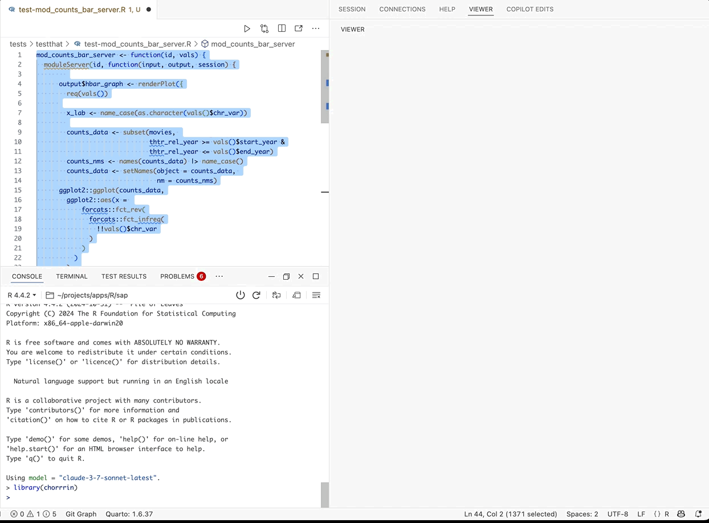

<!-- README.md is generated from README.Rmd. Please edit that file -->

# chorrrin

<!-- badges: start -->

<!-- badges: end -->



The goal of `chorrrin` is to provide helpers (prompts for the [`chores`
package
addin](https://simonpcouch.github.io/chores/articles/custom.html#extension-packages)).

## Prerequisites

Follow the [`chores`
documentation](https://simonpcouch.github.io/chores/articles/chores.html#choosing-a-model)
to configure a model with [`ellmer`](https://ellmer.tidyverse.org/).

## Installation

You can install the development version of `chorrrin` from
[GitHub](https://github.com/mjfrigaard/chorrrin) with:

``` r
# install.packages("pak")
pak::pak("mjfrigaard/chorrrin")
```

## Using helpers

The following will add helpers to your `chores` addin:

``` r
library(chorrrin)
```

The [`shinymod`
helper](https://github.com/mjfrigaard/chorrrin/blob/main/inst/prompts/shinymod-prefix.md)
will add `roxygen2` documentation to a Shiny module.

The [`modtest`
helper](https://github.com/mjfrigaard/chorrrin/blob/main/inst/prompts/modtest-replace.md)
will add `testthat` tests using [Shiny’s
`testServer()`](https://shiny.posit.co/r/articles/improve/server-function-testing/)
function.
